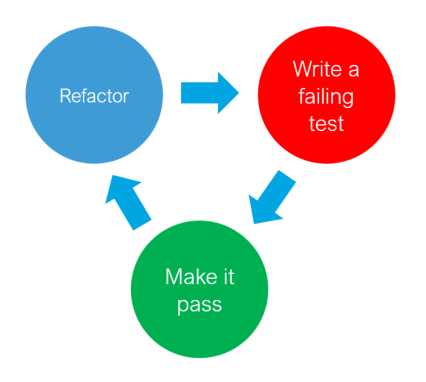

# String Calculator Kata

This is a [Code Kata](https://codekata.com/) to exercise Test-Driven Development (TDD).

Original site: https://osherove.com/tdd-kata-1.

## Requirements

* Python 3.09 or higher
* Pytest

## The TDD Cycle

1. Write a failing test
2. Make the test pass
3. Refactor the code. After refactoring, all tests must still pass.
4. Goto step 1.

## The Kata

### Rules

* Start with Step 1.
* Work incrementally. Do not expand a step before the previous one is solved.
* Only test for correct inputs. There is no need to test for invalid inputs (e.g. `null`) in this Kata.

### Exercises

Step 1

Create a new method named `int add(String numbers)` in class `StringCalculator`.

1. The method can take 0, 1 or 2 numbers, and will return their sum (for an empty string it will return 0). Example inputs: `""` or `"1"` or `"1,2"`.
2. Start with the simplest test case of an empty string, and move to one and two numbers.
3. Remember to solve things as simply as possible, so that you force yourself to write tests you did not think about.
4. Remember to refactor after each passing test.

Step 2

Allow the `add` method to handle an unknown amount of numbers.

Step 3

Allow the `add` method to handle new lines between numbers (instead of commas).

1. The following input is ok:  `"1\n2,3"`  (will equal 6)
2. The following input is NOT ok: `"1,\n"` (not need to prove it - just clarifying)

Step 4

Support different delimiters

1. To change a delimiter, the beginning of the string will contain a separate line that looks like this: `"//[delimiter]\n[numbers…]"`  
   for example `"//;\n1;2"` should return three where the default delimiter is `;`.
2. The first line is optional. All existing scenarios should still be supported.

Step 5

Calling `add` with a negative number will throw an exception "negatives not allowed" - and the negative that was passed. If there are multiple negatives, show all of them in the exception message.

**Stop here** if you are a beginner. Continue if you can finish the steps so far in less than 30 minutes.

Step 6

Numbers bigger than 1000 should be ignored, so adding 2 + 1001  = 2

Step 7

Delimiters can be of any length with the following format:  `"//[delimiter]\n"`. For example: `"//[\\***]\n1\***2***3"` should return 6

Step 8

Allow multiple delimiters like this: `"//[delim1][delim2]\n"`.  
For example `"//[*][%]\n1*2%3"` should return 6.

Step 9

Make sure you can also handle multiple delimiters with length longer than one char.

